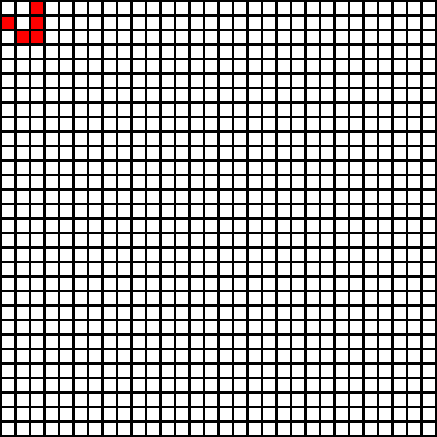

# Conway's Game of Life

Simple implementations of Conway's Game of Life in various programming languages.

Produces a GIF of your simulation to a desired length.

NOTE: a GUI is needed for development, so Linux on WSL is, at least currently, not an option.

## TODOs

Languages:

- [x] Python
- [ ] Java
- [ ] JavaScript
- [ ] Racket
- [ ] Go
- [ ] Rust
- [ ] Elm

Functionality:

- [ ] Command-line arguments to customize output

## Credit

Starter code and inspiration comes from a CPSC 203 assignment at UBC.
